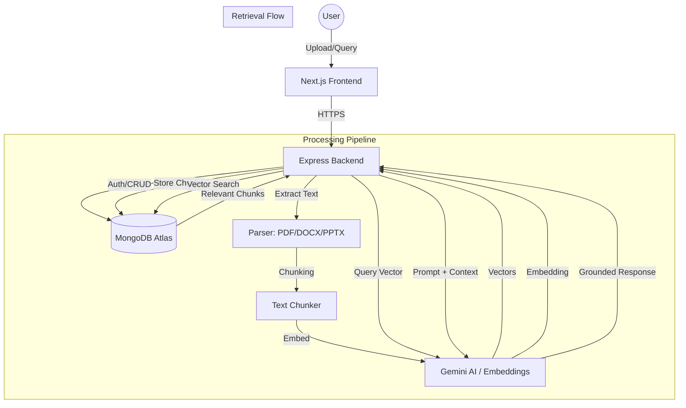

# Document Intelligence Platform

A comprehensive platform for uploading, processing, and interacting with documents using AI (RAG).

## Features
- **Multi-user Isolation**: Secure JWT authentication with **Google OAuth** and email/password sign-in, featuring strict data partitioning.
- **Document Processing**: Pipeline for PDF, DOCX, and PPTX extraction and chunking.
- **Intelligent RAG**: Multi-step retrieval using MongoDB Atlas Vector Search.
- **Grounded AI Chat**: Conversational interface with contextual source citations and snippet references.
- **Premium UI**: Modern, responsive design built with Next.js 15 and Framer Motion.

## High-Level Architecture

## Setup Instructions

### Backend
1. `cd Backend`
2. `npm install`
3. Create `.env` from `.env.example` and add your keys.
4. `npm run dev`

### Frontend
1. `cd Frontend`
2. `npm install`
3. `npm run dev`

## Tech Stack
- **Frontend**: Next.js 15, Tailwind CSS, Framer Motion, Lucide Icons, Axios.
- **Backend**: Node.js, Express, TypeScript, Mongoose.
- **Database**: MongoDB (Atlas Vector Search enabled).
- **AI**: Google Gemini (2.5 Flash + Embedding-001).
